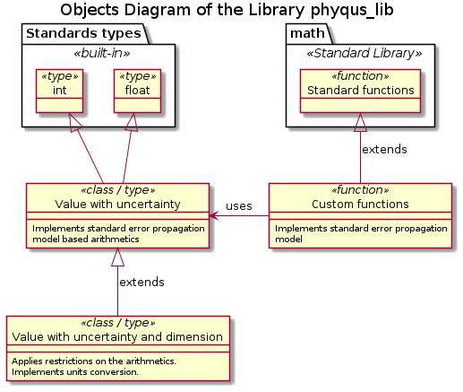

# DE000 Design of the library phyqus_lib

## Purpose of the library

The goal of this library is to implement the *physical*, scientific calculations, which extend the standard arithmetics and algebra by introducing the concept of the *measurement uncertainty*, *dimension* and *measurements unit* properties of a measured value. For instance, one measures the length of a piece of some materual with a ruler with 1 mm scale. Suppose that the reading of the ruler is 25, then the *measured value* is 25, its *measurement uncertainty* is 0.5 (half the scale division), and the *dimension* is length with the *unit of measurements* being 'mm'; in other words, the result of the measurement is 25.0 +/- 0.5 \[mm\].

Note the distinction between between the *dimension* and the *unit of measurements* associated with the dimension. For instance, 25.0 +/- 0.5 \[mm\] and 2.50 +/- 0.05 \[cm\] are the different expressions of the same measured value with the same uncertainty; and in the both cases the dimension is the same - length, but the value and the uncertainty are expressed in the different units - mm and cm respectively.

Thus, the result of a measurement is not a single number, but a 3-elements tuple of (value, uncertainty, measurement unit), provided that there are rules for:

* Mapping of the measurement unit onto the dimension of the measured value
* Conversion between the values expressed in the different units for the same dimension
* Limitations applied to the binary arithmetic opearation by the dimensions of the operands

Therefore, this library should provide:

* New *data type(s)* as class(es) implementing:
  * Arithmetic operations between instances of such class(es) as well as with usual scalar (dimensionless) values (i.e. numbers)
  * Conversion between the different units of measurements for the same dimension
* Functions extending the built-in mathematical functions in Python to support not only the usual numbers (built-in scalar data types), but the instances of such class(es) as well

## General design

A measured value doesn't have to have a dimension, therefore the associated measurements unit; consider determination of the ratio of two measured values (e.g. lengths or weights) or read-out of a digital sampling sensor, which reports the 'mean' measured value and the standard deviation of the sample / standard error of the mean. Therefore, a *dimensionless* measured value is a special case of a generic measured value. Furthermore, a dimensionless measured value with zero uncertainty is, in essence, a simple scalar value, i.e. a number.

The introduction of the measurement uncertainty extends the real numbers arithmetics onto 2D plane (value vs uncertainty), similar to the complex numbers arithmetics. Therefore, any function can be extended onto the same 2D plane as well as long as it can be expressed in the form of a convregent Taylor expansion series. For example, any trigonometric function, except of the singularity points.

The introduction dimension property applies a number of limitations on the arithmetic operations, e.g. only the same dimension values can be added or substructed. Therefore, even simple trigometric functions have no meaning on the values with dimension. Thus, if and when required the measured values with a dimension should be treated as dimensionless values with uncertainty during the application of functions.

Hence, the relation between the objects to be implemented in this library and the standard Python functionality can be symbolically described as in the diagram below.

See [DE001](./DE001_standard_error_propagation_model.md) and [DE002](./DE002_physical_arithmetics.md) documents on the standard error propagation model and additional rules applied on the arithmetic operations by the dimensions of the operands.
