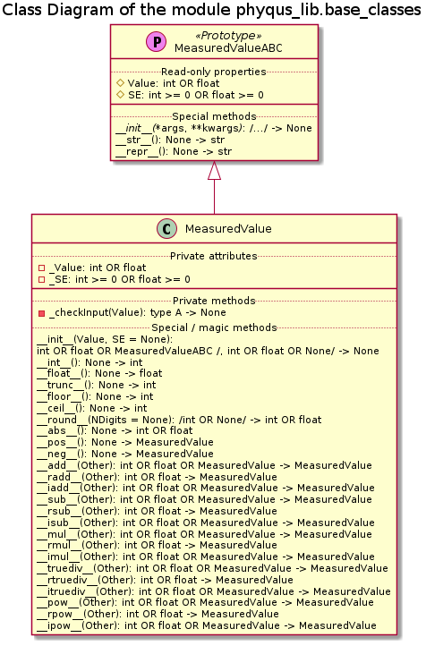

# Module phyqus_lib.base_classes Reference

## Scope

This document describes the intended usage, design and implementation of the functionality implemented in the module **base_classes** of the library **phyqus_lib**. The API reference is also provided.

This module contains only a single class intended to be used by the clients of the library - **MeasuredValue**.

## Intended Use and Functionality

This module implements a new data type - a measurement with the associated uncertainty - as well as the arithmetic operations with this new data type. A measurement with uncertainty is a convenient manner to represent a 'real life measurement result' in the following situations:

* a reading of an analogue gauge - e.g., a ruler - when the read-out value has the fundamental uncertainty of $\pm$ half of the measurements scale division
* a reading, which is an arithmetic mean of a series of individual takes - e.g., of a digital detector with a finite sampling length

A measurement with uncertainty is, basically, a tuple of two real numbers $(x_i, z_i)$, where $x_i$ represents the 'mean' of the measured value, and $z_i \geq 0$ is the measurement uncertainty. Thus, any real number $x_i$ can also be represented as a measurement with *zero* uncertainty, i.e. $(x_i, 0)$.

The arithmetic operations with such tuples should consider not only the 'mean' values, but the associated uncertainties as well. The rules described below are valid if the both operands are *independent* measurements, and these rules form the so called *normal error propagation model*.

### Addition

$$(x_1, z_1) + (x_2, z_2) \equiv (x_2, z_2) + (x_1, z_1) = \left(x_1 + x_2, \sqrt{z_1^2 + z_2^2}\right)$$

If the second operand is a real number, the rule is simplified to

$$(x_1, z_1) + x_2 \equiv x_2 + (x_1, z_1) = (x_1 + x_2, z_1)$$

### Subtraction

$$(x_1, z_1) - (x_2, z_2) \equiv - \left( (x_2, z_2) - (x_1, z_1) \right)= \left(x_1 - x_2, \sqrt{z_1^2 + z_2^2}\right)$$

If the second operand is a real number, the rule is simplified to

$$(x_1, z_1) - x_2 \equiv - (x_2 - (x_1, z_1)) = (x_1 - x_2, z_1)$$

### Multiplication

$$(x_1, z_1) * (x_2, z_2) \equiv (x_2, z_2) * (x_1, z_1) = \left(x_1 * x_2, \sqrt{x_2^2 * z_1^2 + x_1^2 * z_2^2}\right)$$

If the second operand is a real number, the rule is simplified to

$$(x_1, z_1) * x_2 \equiv x_2 * (x_1, z_1) = (x_1 * x_2, z_1 * \left| x_2 \right|)$$

### Division

$$(x_1, z_1) / (x_2, z_2)  = \left(\frac{x_1}{x_2}, \sqrt{\frac{z_1^2}{x_2^2} + \frac{x_1^2 * z_2^2}{x_2^4}}\right) \, \mathbf{if} \, x_2 \neq 0$$

If the second operand is a real number, the rule is simplified to

$$(x_1, z_1) / x_2 = \left(\frac{x_1}{x_2}, \frac{z_1}{\left| x_2 \right|}\right) \, \mathbf{if} \, x_2 \neq 0$$

$$x_2 / (x_1, z_1) = \left(\frac{x_2}{x_1}, \frac{\left| x_2 \right| *z_1}{x_1^2}\right) \, \mathbf{if} \, x_1 \neq 0$$

### Exponentiation

In the general case:

$$(x_1, z_1)^{(x_2, z_2)} = \left( x_1^{x_2}, x_1^{x_2} * \sqrt{\frac{x_2^2 * z_1^2} {x_1^2} + ln^2(x_1) * z_2^2} \right) \, \forall \, x_1 > 0$$

In the case of the real number as the second operand

$$(x_1, z_1)^{x_2} = ({x_1}^{x_2}, \left| x_2 \right| * z_1 * \left| x_1 \right|^{x_2 - 1})$$

This rule is valid with the following limitations:

* For a positive 'mean' and any real number exponent ($x_1 > 0 \, \mathbf{AND} \, x_2 \in \mathbb{R}$)
* For a non-zero 'mean' and any non-zero integer exponent ($x_1 \neq 0 \, \mathbf{AND} \, x_2 \in \mathbb{Z}$)

The special cases are:

$$(0, z_1)^k = (0,z_1^k) \, \forall \, k \in \mathbb{R} \, \mathbf{AND} \, k > 0$$

$$(x_1, z_1)^0 = (1,0) \, \forall \, x_1$$

In the case of the real number as the first argument

$$x_2^{(x_1, z_1)} = (x_2^{x_1}, ln(x_2) * x_2^{x_1} * z_1) \, \forall \, x_2 > 0$$

### Special case - the second operand is the same object

If the second operand is the same object (as in *a + a*) and not other object with the same values of the 'mean' and uncertainty the assumption of the independence of the uncertainties is not valid. In this case the following rules are applied:

$$(x_1, z_1) + (x_1,z_1) \equiv 2 * (x_1, z_1) = (2 * x_1, 2 * z_1)$$

$$(x_1, z_1) - (x_1,z_1) = (0, 0)$$

$$(x_1, z_1) * (x_1,z_1) \equiv (x_1, z_1)^2 = (x_1^2, 2 * z_1 * \left| x_1 \right|)$$

$$(x_1, z_1) / (x_1,z_1) = (1, 0)$$

$$(x_1, z_1)^{(x_1,z_1)} = (x_1^{x_1}, \left| x_1^{x_1} \right| * (1 + ln(x_1)) * z_1) \, \forall \, x_1 > 0$$

## Design and Implementation

The class diagram of the module is shown below.



The class **MeasuredValueABC** is an Abstract Base Class, which cannot be instantiated, and it is added simply for the benefit of the type hinting. It does not internal *state* (fields), but it implements the read-only properties *Value* and *SE*, which simply return the values of the *instance* attributes *_Value* and *_SE*. Note that these attributes are not present in this class, but they are defined in its sub-class **MeasuredValue**. It also defines the 'magic' / special hook methods evoked when the standard functions *str*() and *repr*() are called on instances of its sub-classes.

The sub-class **MeasuredValue** re-defines the *\_\_init\_\_*() methods, so it is no longer virtual. An instance of this class can be initialized from a real number or another instance of the API compatible class (having *Value* and *SE* fields or properties):

* Single argument passed:
  * of **int** or **float** type ('IS A' check) - the value is copied as the 'mean', and the uncertainty is set to zero
  * another measurement with uncertainty ('HAS A' check on itself + 'IS A' check on its attributes) - the 'mean' and uncerainty values of the passed argument are copied
* Two argumnents passed, with the second being a non-negative real number (int or float):
  * the first argument is of **int** or **float** type ('IS A' check) - the value is copied as the 'mean', and the uncertainty is set to the value of the second argument
  * the first argument is another measurement with uncertainty ('HAS A' check  + 'IS A' check on its attributes) - the 'mean' value of the passed argument are copied, and the uncertainty is set to the value of the second argument

**Note**: a class is considered to be API compatible with the **MeasuredValue** class if it has:

* *Value* attribute, which is a real number, AND
* *SE* attribute, which is a non-begative real number

If the first argument is neither **int**, nor **float**, nor an instance of the API compatible class, OR the second argument is neither **int**, nor **float**, nor **None** (which is simply ignored) the **UT_TypeError** is raised, which is a sub-class of the standard **TypeError** exception. If the second argument is a negative number - the **UT_ValueError** is raised, which is a sub-class of the standard **ValueError** exception. The both exceptions are defined in *introspection_lib.base_exceptions* module, and they provide the extended built-in traceback analysis functionality. The instantation method also instructs them to 'hide' the innermost frame, unless they are not caught (system dump always shows the full, real traceback). For instance, in the following sniplet, the printed traceback will contain only a single frame, pointing the the improper instantiation call, i.e. `a = MeasuredValue('1')`.

```python
from phyqus_lib.base_classes import MeasuredValue

a = MeasuredValue(1) # -> (1, 0)
b = MeasuredValue(-2.4, 0.1) # -> (-2.4, 0.1)
a = MeasuredValue(b) # -> (-2.4, 0.1)
a = MeasuredValue(b, 0.2) # -> (-2.4, 0.2)
try:
    a = MeasuredValue('1') #UT_TypeError will be raised
except (TypeError, ValueError) as err:
    print(err.__class__.__name__, ':', err)
    print(err.Traceback.Info)
```

This class also implements the arithmetic operations:

* addition, subtraction, multiplication and division - with an instance of this class being either left or right operand, and the second operand being either a real number ('IS A' check) or an instance of an API compatible class (measurement with uncertainty, 'HAS A' check + 'IS A' check on its attributes)
* exponentiation (power) - with an instance of this class being the left operand, and the right operand being a real number ('IS A check)

The result of such an operation is always an instance of the **MeasuredValue** class. The augmented assigment versions of these operations are also supported.

The input data sanity check (the second operand data type) is delegated to a 'private' helper method, which raises **UT_TypeError** with the instruction to 'hide' the 2 innermost frames. Thus, being caught in *except* clause (as in the sniplet above) the *Traceback* property of the exception will end in the frame, where the offending operation has happend, instead of showing the internals of the arithmetic operation implementation.

Additional limitations are applied for the special cases:

* Division by zero:
  * the right operand of the division is either a real number zero, or a measurement with  uncertainty and the zero 'mean' value - **UT_ValueError** is raised instead of **ZeroDivisionError**
    * exception from this case is when a measurement with zero 'mean' is divided by itself, in which case the operation is valid and the result is (1, 0)
  * a measurement with zero 'mean' is raised to a negative power - **UT_ValueError** is raised instead of **ZeroDivisionError**
* A measurement with a negative 'mean' is raised into a non-integer power - **UT_ValueError** is raised

## API Reference

### Class MeasuredValue

Implements the data type to store a measurement mean value and the bound uncertainty as well as the basic arithmetic operations, including the augmented assignments.

The addition, subtraction, multiplication and division are supported for both operands having uncertainty as well as only one operand having it and the second operand being a plain real number. The power operation is implemented only for the real number exponent, whereas the base being an instance of this class.

Avoids **ZeroDivisionError** by checking operands and raising **UT_ValueError** instead.

Also supports the data conversion into **int** and **float** (i.e., lossing SE information), the *abs*() and *round*() standard functions support as well as *math.tunc*(), *math.ceil*() and *math.floor*().

Note that this data type does not support comparison operations.

__*Class and Instance Data Attributes*__:

* *Value*: (read-only property) int OR float; the mean value of a measurement
* *SE*: (read-only property) int >= 0 OR float >= 0; the measurement uncertainty

__*Initialization*__:

**\_\_init\_\_**(Value, SE = None)

*Signature*:

int OR float OR MeasuredValueABC /, int OR float OR None/ -> None

*Args*:

* *Value*: int OR float OR MeasuredValueABC; the mean value of the measurement with optional uncertainty (if instance of sub-class of MeasuredValueABC is passed)
* *SE*: (optional) int OR float; the associated measurement uncertainty, if provided (not None), overwrites the value assigned based on the first argument

*Raises*:

* **UT_TypeError**: the first argument is not int, float or instance of MeasuredValueABC sub-class, which is checked as 'HAS A' on itself + 'IS A' on its required attributes, OR the second argument is not int, float or None
* **UT_ValueError**: the second argument is negative

*Description*:

Supports four modes of call:

* single argument of int or float type - passed value is set as the mean, whereas the SE is set to zero
* single argument as instance of sub-class of MeasuredValueABC (checked as 'has a') - the mean and SE value are copied
* two arguments of int or float type - copied as the mean and SE values respectevely
* first argument of MeasuredValueABC sub-class type and the second of int or float type - the mean value of the first argument is copied as the mean, the second argument is copied as SE
